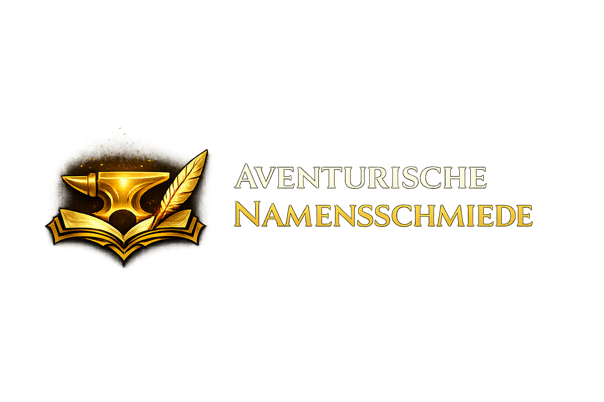

<p align="center" style="margin: 0; padding: 0;">
  
</p>

Ein Namens- und Charaktergenerator für **Das Schwarze Auge**. Die
**Web-Version** ist der primäre Zugang und erzeugt kulturell passende Namen,
regionale Varianten und einfache NSC-Profile direkt im Browser.

## Was die App bietet

- **Web-App** für Generator, Regionenübersicht und Favoriten
- **CLI** für lokale Nutzung und Skripting
- **54 konkrete auswählbare Kulturen/Regionen** sowie **6 Sammelauswahlen**
- **Namens- und Charaktergenerierung** mit Geschlechtsfilter und Berufskategorie
- **PDF- und JSON-Export** in der Web-Version

# ⚠️ WARNING: VIBE-CODE PROJECT ⚠️

> [!WARNING]
> Große Teile dieser Codebase wurden mit AI-Tools erstellt
> (z. B. **ChatGPT Codex**, **Claude Code**).

## Web-Version

Die Anwendung ist in erster Linie für die Nutzung im Browser gedacht. Dort sind
die wichtigsten Funktionen direkt verfügbar:

- Namen oder Charaktere generieren
- Regionen durchsuchen
- Favoriten lokal verwalten
- Ergebnisse als `PDF` oder `JSON` exportieren

Für lokale Entwicklung startet die Web-App mit Docker:

```bash
docker compose up --build
```

Danach erreichbar unter <http://localhost:8000>.

## Schnellstart lokal

```bash
uv sync
uv run namegen
```

`uv run namegen` startet ohne Unterbefehl direkt das interaktive CLI-Menü.

Ein paar direkte Beispiele:

```bash
uv run namegen regions
uv run namegen simple mittelreich_kosch --gender female --count 5
uv run namegen simple nostria --character --profession-category profan --count 4
```

## Weiterführende Dokumentation

- [Content Guide](docs/content_guide.md) für Regionen, Kulturen und TOML-Daten
- [Observability](docs/observability.md) für Metriken, Traces und Monitoring
- [Deployment](infra/DEPLOYMENT.md) für Rollout und Produktionsbetrieb
- [VPS Setup](infra/VPS_SETUP.md) für Server-Vorbereitung

## Entwicklung

```bash
uv sync
env UV_CACHE_DIR=/tmp/uv-cache uv run pytest
env UV_CACHE_DIR=/tmp/uv-cache uv run ruff check .
env UV_CACHE_DIR=/tmp/uv-cache uv run ruff format .
```

## Rechtlicher Hinweis

**Das Schwarze Auge** ist eine eingetragene Marke der **Ulisses Spiele GmbH**.
Dieses Projekt ist ein privates, nicht-kommerzielles Fanprojekt und steht in
keiner offiziellen Verbindung zu Ulisses Spiele.

Erstellt gemäß den
[Fan-Richtlinien von Ulisses Spiele](https://ulisses-spiele.de/fan-richtlinie/).

Weitere Hinweise stehen auch in der Web-App unter
[`/impressum`](/rechtliches) und [`/datenschutz`](/datenschutz).
